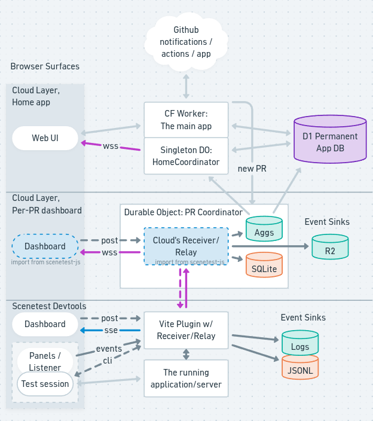

# Scenetest Cloud — Architecture

Scenetest runs end-to-end tests with inline assertions: a Vite plugin injects
a listener into the app under test, a CLI drives Playwright sessions, and a
dashboard shows assertion results live. This document describes how the dev
tool and the cloud service share one architecture.

> **Status.** This describes the *intended* architecture. The one place the
> running code meaningfully differs from the target is the test box: it
> hand-rolls its relay in a small agent today, and is converging on the shared
> **receiver** package. The text marks that **(transitional)**.

## The system, top to bottom



GitHub is the one git host we support. It sends webhooks to the **App's Main Worker**
— which authenticates them, records the PR, and spins up the PrCoordinator for that PR.
Alongside the Worker runs a singleton Durable Object: **The Home Coordinator**
which holds the realtime WebSocket connections to the web
interface and pushes live updates about running tests, reading settled state
from a **D1** database. The Worker, the Home Coordinator, and D1 together are
the permanent, cross-PR top of the system — the part that outlives any one run.

One level down is **The PR Coordinator** – everything that happens inside a
single PR. It's meant to mimic what a developer experiences on their own machine,
carrying test events up from the test box and out to the realtime dashboard,
as well as directions back down to trigger test runs via the CLI. It is the
top-level collator of the entire test log for this PR across all runs, using
SQLite and auto-increment to set a canonical order for the log across all
tests/runs/boxes. The PrCoordinator is also responsible for spinning up and
down the test boxes, and archiving the SQLite log in R2 after each run.

The test suite, along with the user's app and setup script, make up the entirety
of the third row in the graphic: **The Test Box**. The box is an ephemeral VPS
which is meant to build the app, run the tests, using the same vite middleware
you use when running `scenetest-js` during local dev. It uses the same CLI to drive
tests and publishes the same dashboard. Except no one can view the box to interact
with that dashboard, so the test box uses a single secure websocket to the
PrCoordinator to send events up and receive directions down, so that the cloud
can embed the scenetest-js project's Dashboard directly, and interpret incoming
events using its Protocol package.

The only difference is the transport – SSE or Websockets – which are different
implementations intended for the different running environments, but which
implement the same interface with events up, directions down.

Directions from either dashboard — cloud or local — terminate at the CLI, which
drives the browser. The CLI returns pass/fail and other results onto the event
log, back to the Vite middleware (the **receiver**), and from there either up to
the cloud or simply into the local logs that accrete in your `scenetest/.reports`
directory. Assertion pass/fail signals arrive from the browser through that same
receiver endpoint, and an injected **listener** watches for console errors and
the like. Both kinds of information — driver results and in-page assertions —
join one event stream and flow outward and upward, outward and upward, until
they settle into Tanstack DB collections on browsers, and aggregates in D1,
served either by the Worker at the top or by its Durable Object for realtime.

## Repository layout

Code is grouped by release channel and deploy cadence rather than by topic.

| Repo | Contents | Ships as | Cadence |
|---|---|---|---|
| `scenetest/scenetest-js` | Vite plugin, CLI (`scenes`), `checks` + framework bindings, `protocol`, `dashboard`, receiver | npm packages, run inside users' projects | Versioned releases; users sit on old versions indefinitely |
| `scenetest/scenetest-cloud` (this repo) | Worker, Durable Object classes, D1 schema/migrations, runner-box provisioning | Deployed by us to our Cloudflare account | Continuous deploy; one live version |

The seam between the two repos is a published package and a wire protocol. A
service deploy and an npm release should never need to be atomic; if they do,
the protocol versioning has failed.

## The protocol package

`@scenetest/protocol` is a small versioned package defining the events traveling up
the wire, and the directions traveling down. Sometimes the transport happens via POST,
sometimes over a websocket or SSE, sometimes by tailing a log – the protocol package
doesn't know about any of these details, it only provides types and validations
(identifier functions like `isRunSummary`) so that any part of the system that emits
or consumes events can do so in a uniform way.

The [protocol package is owned by the scenetest-js
repository](https://github.com/scenetest/scenetest-js/tree/main/packages/protocol),
because that is a stand-alone tool without the cloud service; so the dependency graph
always points from this repo to that one.

## Sequenced Events Relay, Directions Path, Transport Client

**Events Relay:** This is the "events up" path; a machine is an events relay if
it accepts events, assigns a stable order, logs them and fans them out to consumers
and other relays, always in the same order. We
currently have two relays:

1. The Vite middleware's package `@scenetest/receiver`
receives events from the running test, and from the CLI, logs them in an assigned
order (`seq`), fans them out to the local dashboard via SSE, and (if running in
cloud mode) passes them up to the PrCoordinator via WSS.
2. The PrCoordinator is also a relay, receiving events from the test box via WSS,
ordering them via SQLite auto-increment (`id`), and fanning out to the dashboards
embedded in the cloud app, as well as to an "aggregates" handler that periodically
reports progress to the HomeCoordinator and stores those meta-items in D1 for long
term storage.

The PrCoordinator implements the same "Relay" shape, but intentionally does not
use the same code, because the implementation differs at nearly every level, with
only the vague shape and the protocol being shared between the two sites.

Note: SSE is the _preferred_ approach for a relay, but between a Durable Object and a
browser, impractical, so we use Websockets/PartySocket.

Note: When version normalisation is needed, the most natural and deployable place
to implement it may be the PrCoordinator, but for now, YAGNI.

**Directions Path:** The directions path is required to validate directions and pass them
along; it is a UI concern, a controller, but it doesn't have to log itself or
assign a stable order or fan out to other things. It goes straight down till it
reaches the Vite server which uses the CLI to start/stop/pause/retry tests. Once
the direction is acted on it goes from being a direction to a fact, and only then is
it recorded and broadcast on the sequenced events stream and passed back up to
relays and user interfaces.

**Transport Client:** The relay's client-side dual and the directions path's initiator.
The dashboard widget (used both as a local dev tool and in the cloud app) calls
the transport client to subscribe to the ordered stream and to
send directions; it speaks to whatever backend is present — Vite middleware (SSE)
in dev, the worker API (WebSocket) in cloud. Because the dev/cloud difference is
confined to this object, the dashboard behaves the same in both by construction.
The subscription replays the ordered stream from a cursor on connect, then delivers
live deltas through the same channel — history and live fold the same way, with no
separate snapshot fetch.

Any consumer of any Events Relay can use the Transport Client to produce real-time
syncing Tanstack DB collections of the stream.

### The dashboard widget

The Preact dashboard is a component the host mounts into its light DOM,
parameterized by a transport adapter. It renders the same UI in dev and cloud;
only the adapter differs.

## The log and its projections

Two storage categories, and nothing is allowed to blur them.

**The log** is every event, append-only, ordered. It is the one source of
truth — the protocol message stream itself. Assertion results, Playwright
actions, driver failures: all of it is one ordered stream of opaque messages.
Directions are *not* in this stream: a direction is a transient instruction, not a
fact, so only its *effect* is logged — a `stop` becomes a `run:end cancelled`,
and starting a run becomes that run's first events.

**Projections** are everything derived from the log: a scene's current status, a
run's score, the home view's toplines, the overview comparison deltas. A
projection is a pure function of the log. Persisting one is always and only a
performance or queryability move — never a new fact, always rebuildable by
replaying the log. This is the rule that keeps the two halves honest: if a
stored value cannot be regenerated from the log, it is either part of the log or
a bug.

`run_id` is a field on each message, not a container. Because runs align with
the order axis, a run is derivable from the log as the messages between two
positions — so a run is a denormalized convenience for the UI (chunking a load,
drawing a timeline, jumping between runs), never a structural boundary. Anything
that splits *by* run — a per-run R2 file, a run filter on a query — does so for
ergonomics on top of an order the log already provides.

One read primitive serves the log to every consumer: a cursor-based fetch of
ordered messages — `read(cursor)` yielding messages in order. `run_id` and `ts`
are ordinary fields, none privileged; the reader takes the whole stream and any
slicing is the client's. The live dashboard, the replay-on-connect, and the
archived-PR read all go through this one door. Whether the bytes come from a live
store or a durable archive is hidden behind it; the consumer sees one ordered
stream.

**The DO is the final authority on the log.**
Whatever box is running tests creates a log of *facts* — `(seq,
payload)` with its own per-run ordering, and then passes it up to the PrCoordinator,
which currently takes in only one fact stream but in theory could take in many. So
it applies its own order, the `id` of inserting into its SQLite log table, minting
the final ID order that will be stable across runs and replays, even if the entire
DO spins down, archives to R2, and gets restored a year later.

These two IDs represent the stable orders for a 2-tiered collation, but in theory
we can add a third or even a fourth collation layer using the same pattern
(`seq`, `seq2`, `seq3`, `id` (final)). For now, YAGNI.

But from this final ID we can recreate every other thing about the PR, including all
its aggregate reporting – so even the aggregates streamed through the HomeCoordinator
are just caches; even if the D1 tables holding these aggregates were destroyed, the
logs held in R2 could regreate them byte for byte.

| | the log | projections |
|---|---|---|
| dev / runner box | local `.jsonl` | derived in the client collection, not persisted |
| cloud, live | DO SQLite log table | DO SQLite aggregate (a cache) + D1 settled |
| cloud, durable | R2 `.jsonl`, per-run files | D1, forever |

The log is one content in three homes — the box's `.jsonl`, the PR object's
SQLite, the R2 archive — differing only in durability and locality. Projections
appear in both environments, but dev derives them in memory and throws them away
(re-deriving from the single `.jsonl` is free in one ephemeral session), while
the cloud persists them, because its projections answer cross-PR queries and must
outlive the PR object that computed them. That persistence is the performance
move; it adds no truth the log does not already hold.

**A past run is projected on read.** The dashboard widget renders a finished run
from `GET /api/cloud/repos/:owner/:name/pr/:number/runs/:runId` — the run's
messages folded into scenes, each carrying its own assertions and timeline. None
of that report is stored: it is folded per request from the log, through the one
read door (the R2 archive once the run is archived, the PR object's SQLite before
that), so a report reads the same however old the run is. The fold is the live
view's own — the widget package exports its projections as pure functions, so the
worker runs over a stored log the same code the browser runs over a live one. One
fold, not two that have to agree. The run list beside it (`GET
.../pr/:number/runs`) is the D1 settled projection instead: naming a PR's runs is
the cross-PR query D1 exists to answer.

**Directions are neither log nor projection.** A direction is a transient
control-plane instruction, not a fact — so it is never logged as such; only the
effect of acting on it enters the stream (above). Its in-flight state (queued
while the box is offline, pending → sent) is control-plane storage — the
coordinator's direction queue — that mutates and is not derivable from
observations; it rides alongside the append-only log, not in it. The box's
`.commands.jsonl` drop was only ever an IPC for the delivery hop, never a record
we need; it retires with the box's move to the receiver.

## Dev mode

The Vite plugin is a thin, same-origin adapter: it injects the listener, mounts
the receiver as middleware, serves the dashboard at `/__scenetest`, and uses an
append-to-`.jsonl` sink. Same-origin matters — no CORS, no extra port, works in
Codespaces and devcontainers.

## Cloud service (this repo)

Units of work, smallest to largest: a scene execution is the atomic unit and is
parameterized (the same scene with a different team is a different execution); a
run is a batch of executions triggered together and owns no infrastructure; a box
is the environment a PR's executions run in; the PR is the unit of coordination,
because a PR getting merged is the goal the whole system serves. These are units
of *work and coordination*, not of storage — in the log a run is a field on each
message, not a container.

Each Cloudflare primitive has one job:

- **The Worker** handles API routes and auth, serves the dashboard shell and
  static assets, and routes run traffic to Durable Objects.
- **One Durable Object per PR** is the coordination point. It owns the box's
  lifecycle (when to provision, what a push requires, when to tear down),
  terminates the box's outbound WebSocket on one side, fans out to dashboard
  viewers on the other (hibernation API), and holds the pending direction queue. It
  also **owns the PR's event log** in its own SQLite; the live fan-out and
  replay-on-connect read from there, and a derived live aggregate may sit beside
  it, droppable and rebuildable from the log.
- **D1** holds only **settled projections** — enough to render lists and the
  cross-PR home view, none of it a fact the log does not already hold. It is never
  an event sink: log lines live in the PR object's SQLite and the R2 archive,
  never in D1. The object writes these projections at run boundaries — a couple of
  writes per run, not per event.
- **R2** holds the durable record: when a run completes the object flushes that
  run's log to a per-run `.jsonl`. A finished run is immutable, so archiving at
  completion is both simpler and more durable — it survives even if the object is
  later evicted, and a closed PR's detail view reads these objects directly
  through the worker with nothing to spin up. The cron sweep is only a backstop
  that archives any terminal-but-unflushed run; it prunes nothing, because D1
  never held the log.

### Runner

One ephemeral box per PR — not per run. The box runs the same code path as a
developer's laptop: app under test, database, seeds, Playwright, the scenes CLI,
the receiver — all local to the box, so scene executions stay atomic. A re-run
against a warm box costs seconds, not a provisioning cycle.

Configuration is the only difference from dev mode: the box's sink writes the
local `.jsonl` and also streams events up the box's single outbound WebSocket to
the PR's Durable Object. Outbound-only means no inbound firewall holes; directions
ride the same socket back down.

Teardown is idle-based and owned by the PR object: a Durable Object alarm is
re-armed on every activity signal and, when it fires after the PR's runs have all
settled, the box is retired. An in-flight run re-arms rather than retiring. A
wall-clock age cap stays only as the hung-box backstop, for boxes the alarm never
retired.

### The runner is a swappable substrate

The runner is not coupled to DigitalOcean. `Runner` is `provision()` +
`dispatch()`, selected by `RUNNER_PROVIDER`, so the machine a box runs on swaps
without touching the coordinator, the log, D1/R2, or the stage cache. The user
contract is the same on every substrate: **bake an image, then run setup
scripts.**

DigitalOcean is the first substrate because it is the most *flexible*: a stock VM
faithfully recreates any dev box, including Docker-based local stacks. Other
substrates (Cloudflare Containers the natural second) join behind the same
interface, trading flexibility for speed or simplicity. The one constraint every
substrate honors is the build model — the stage cache's *state* stages mutate a
live, warm box, so a container runs that same staged build inside itself rather
than baking the whole box into one immutable image.

### The build pipeline

Provisioning and updating a box is staged, and each stage is keyed by a content
hash of its declared inputs. A stage runs only when its hash changes; a changed
stage invalidates every stage after it. Two kinds of stage sit behind a **global**
cache table keyed `(stage, input_hash)` — global, so one PR reuses work another PR
(or a past merge) already did:

- **Artifact stages** (image, deps, build): a cache hit fetches the artifact.
- **State stages** (db reset, deploy): nothing to fetch; a hit means the box
  already embodies that state. The box carries the vector of stage hashes it has
  realized, and on each push the PR object diffs desired against realized and runs
  from the first divergence.

Hashes are computed in the worker at webhook time, before any box exists: git is
already content-addressed, and the GitHub API returns the tree hash of any path at
any commit without a clone. Keys are content hashes rather than commit SHAs, so a
rebase invalidates nothing, a merge to main reuses the merged PR's artifacts, and
a docs-only push does nothing. When a push rebuilds the box, in-flight runs on the
old state are cancelled immediately — latest wins; the only state worth a verdict
is the one that might merge.

The pipeline definition (stage commands and watch globs) lives in the user's repo,
because it must change atomically with the code it builds, and is hashed like any
other input. The cloud UI gets only operational verbs (full reset, re-seed,
force-rebuild from stage N), which travel the directions path and are never
configuration. The split rule: anything that affects artifact content lives in the
repo; anything operational lives in the UI — otherwise the same tree would build
differently on different days and the content-addressing would rot.

### Auth

Three surfaces:

1. **Humans:** GitHub OAuth, stateless HMAC-signed session cookies, an
   `allowed_user` allowlist. The viewer/home WebSocket routes also accept the
   session token via `?session=` for header-less test clients, but a bearer in a
   URL is loggable where a cookie isn't (CWE-598), so that fallback is gated to
   dev/test and refused in cloud.
2. **Runner box and CLI:** a bearer token minted when the box is provisioned,
   scoped to that box and dead when it is destroyed; the PR's Durable Object
   validates it on the WebSocket handshake.
3. **GitHub webhooks:** HMAC signature verification with the webhook secret.

## Event flow: assertion result to watcher's screen

The cloud path, end to end. Steps 1–3 are identical on a laptop in dev mode.

```
 runner box                               Cloudflare                viewer
┌─────────────────────────────┐      ┌──────────────────┐      ┌────────────┐
│ Playwright-driven browser   │      │                  │      │ dashboard  │
│   └─ injected listener ──┐  │      │  Worker (Hono)   │      │ widget     │
│ CLI / Playwright events ─┤  │  WS  │    └─ PR DO ─────┼──WS──┼─ transport │
│   sequenced events relay◄┘  ├──────┼──►  • SQLite log │      │  client    │
│     ├─ .jsonl sink          │      │     • fan-out    │      └────────────┘
│     └─ upstream sink ───────┘      │     • cmd queue  │
│                                    │  projections→D1  │
│                                    │  log→R2 @ done   │
└────────────────────────────────────┴──────────────────┘
```

1. In the Playwright-driven browser on the box, a `should()` check resolves. The
   injected listener captures it and POSTs it same-origin to the box-local
   receiver.
2. The box-side **receiver** *(transitional: today a hand-rolled agent;
   converging on the receiver package)* accepts it as a protocol event. CLI
   events — Playwright actions, "can't click this element" — enter at the same
   point via `SCENETEST_REPORT_URL`.
3. The event goes to both sinks: appended to the local `.jsonl`, and handed to the
   upstream sink, which sends it over the box's authenticated outbound WebSocket.
4. The worker routes the socket to the PR's Durable Object.
5. The Durable Object validates the box token, appends the event to its SQLite log
   (the source of truth), updates the live aggregate, and pushes the event to
   every connected viewer socket. Settled projections go to D1 at run boundaries.
6. The viewer's transport adapter receives the event, the dashboard store updates,
   and Preact paints the new assertion row.

In dev mode the trace collapses: listener → same-origin middleware → receiver →
`.jsonl` sink + in-process broadcast (SSE) → the dashboard. Same events, same
widget, same receiver, minus the Cloudflare hops.

Directions flow the reverse path: viewer → transport adapter → worker → PR object's
direction queue → down the box's WebSocket → the receiver forwards to the CLI →
resulting events flow back up. *(Transitional: the box acting on directions — the
inbound direction channel that drives the CLI — is the open piece converging with
the receiver-on-box work.)*

## The home view

Every project's open PRs, with live run status and a coarse rollup. It is a
projection of events the system already has, at a coarser granularity.

Alongside fine-grained assertion events, the protocol defines a run-status family
(`run.started`, `run.progress {pct, failing}`, `run.finished {score}`). Each PR
object computes these rollups from the events it already sees and pushes them **up
to a singleton `HomeCoordinator` Durable Object by direct object-to-object call** —
one-way and sparse, never a socket. **Only this rollup crosses up; raw assertion
events never leave the PR's own viewers** — the home tier sees aggregates, not the
stream. The worker can't be that rendezvous (stateless, per-request); the DO is the
connection-holding primitive, the same reason `PrCoordinator` exists, one level up.

`HomeCoordinator` owns no canonical state: it holds a last-write-wins tile cache
rebuilt from the D1 projections on cold start, and fans deltas out to the home
dashboard's WebSocket subscribers. The PR list itself comes from GitHub webhooks
(opened/closed/merged → HMAC-verified handler → upsert into D1 → poke the
`HomeCoordinator`). The home view paints from the D1 snapshot and overlays live
tiles from the subscription. It is cloud-only code in this repo; it has no
dev-mode counterpart.
